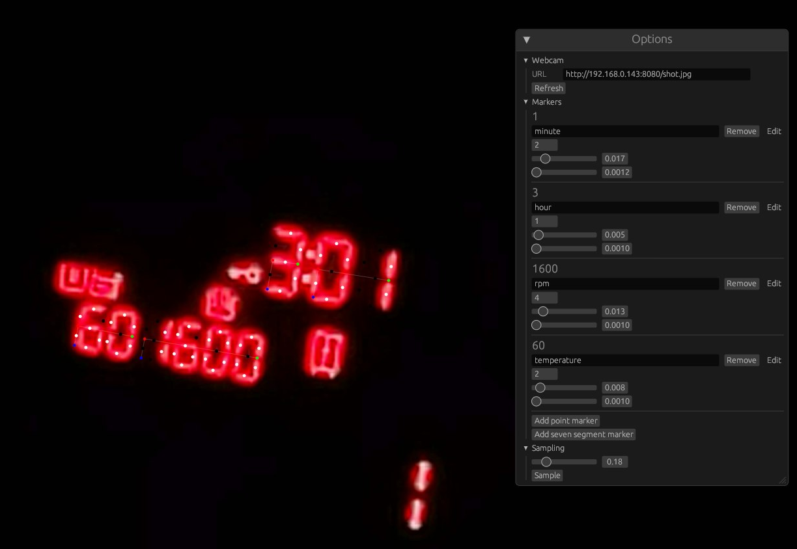

This is a prototype to get the current status of my laundry machine into MQTT,
and subsequently Home Assistant. Although, there's no reason it *only* works
for laundry machines, it's really just a sort of OCR for seven-segment
displays, and also supports miscellaneous indicators. Therefore I'll probably
change the name to something else soon.

:construction: THIS PROJECT REEKS OF PROTOTYPE
==============================================

Unless you really need something like this right now, don't use it! If I'm
motivated enough I might flesh it out into a more usable program, but as it
stands now, it's not very usable for anyone but me.

